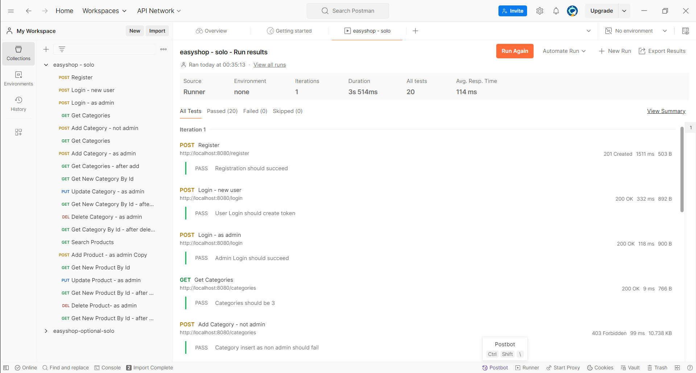
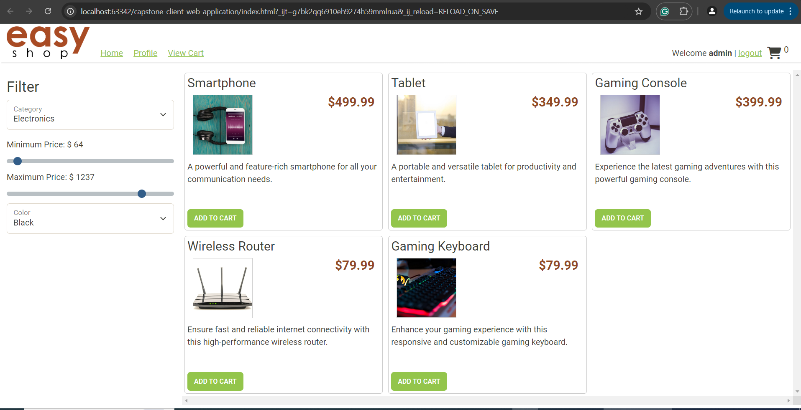

# EasyShop Project

## Description of the Project

The **EasyShop** project is a dynamic e-commerce platform built using Spring Boot for the backend and MySQL for the database. It provides users with an intuitive online shopping experience, allowing them to register, browse products across various categories, and filter items based on specific preferences such as price and color. Admins have full control over managing the product catalog and categories, including the ability to add, update, or remove items. This project aims to create a robust backend infrastructure, enabling smooth functionality and offering a seamless experience for both customers and administrators.

## User Stories

- As a **User**, I want to filter products by category, price range, and color, so I can find products that meet my specific preferences and needs.
- As an **Admin**, I want to add new products to the inventory to expand the variety of items available to customers.
- As an **Admin**, I want to update existing product information, such as price or description, so that the product catalog reflects the most accurate data.
- As an **Admin**, I want to be able to retrieve a list of all categories, so I can see the entire catalog structure at a glance.
- As an **Admin**, I want to fetch the details of a specific category using its ID, so I can review and make updates to the category’s attributes.
- As an **Admin**, I want to be able to add new categories to the system so that I can organize products into more relevant classifications.
- As an **Admin**, I want the ability to edit existing categories, so I can modify their names, descriptions, or other important details.
- As an **Admin**, I want to remove outdated or unnecessary categories from the system so that the catalog remains organized and up-to-date.
- As a **User**, I want to view detailed product information, so I can make informed decisions before making a purchase.

## Setup

Follow these instructions to set up and run the project locally using IntelliJ IDEA.

### Prerequisites

- **IntelliJ IDEA**: Make sure IntelliJ IDEA is installed. You can download it from [here](https://www.jetbrains.com/idea/download/).
- **Java SDK**: Ensure that Java SDK 11 or higher is installed and configured in IntelliJ.
- **MySQL**: Install MySQL and create the necessary database for storing product and category data.

### Running the Application in IntelliJ

1. Clone the repository to your local machine.
2. Open **IntelliJ IDEA** and select "Open" to load the project directory.
3. Wait for IntelliJ to index the files and set up the project dependencies.
4. Find the main class that contains the `public static void main(String[] args)` method.
5. Right-click on the class and select 'Run' to start the application.
6. You can access the REST API endpoints via `http://localhost:8080`.

## Technologies Used
- **Java**: Version 11 or higher.
- **Spring Boot**: Framework for developing the backend REST API.
- **MySQL**: Relational database for storing product and category information.
- **Maven**: For managing project dependencies and building the project.

## Demo

Below are a few visual demos showcasing the application:

*Example of testing API endpoints with Postman.*

*The frontend displaying products on the website.*

## Future Work

Some potential areas for future development include:
- **Payment Integration**: Implementing secure payment gateways to facilitate online transactions.
- **Order Tracking**: Enabling users to track their orders from placement to delivery.
- **Advanced Search Filters**: Enhancing product search capabilities with additional filters like ratings, brands, and more.
- **Security Upgrades**: Integrating authentication and authorization to manage user access and protect sensitive data.
- **Mobile Compatibility**: Developing a mobile-friendly version of the platform or providing a dedicated mobile app.

## Resources

Here are some helpful resources that were used during the project development:

- [Java Programming Tutorial](https://www.example.com)
- [Spring Boot Documentation](https://docs.spring.io/spring-boot/docs/current/reference/html/)
- [Effective Java](https://www.example.com)

## Team Members

- **Mehmet Uzun** - Project creator and developer.

## Thanks

- Special thanks to **Raymond Maroun** for his continuous support and guidance throughout the development process. 
- A special thanks to all teammates for their dedication and teamwork.